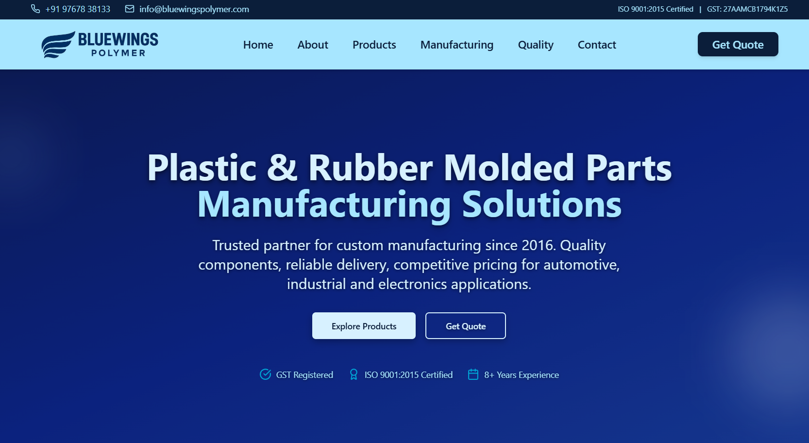

# 🏭 Blue Wings Polymer — Official Website

### Corporate Website for a Leading Polymer & Precision Parts Manufacturer

 

**[🌐 Live Website](https://bluewingspolymer.com/) · [👤 Developer Portfolio](https://jayeshjadhav.com/)**

 

> ⚠️ **This repository contains only documentation.**
> The source code is proprietary and confidential — developed under a client agreement.

 

<!-- SCREENSHOT — replace with actual -->

---

## 📌 Table of Contents

- [About the Project](#-about-the-project)
- [Live Website](#-live-website)
- [Pages & Features](#-pages--features)
- [Tech Stack](#-tech-stack)
- [Highlights](#-highlights)
- [Clients Served](#-notable-clients-served)
- [Developer](#-developer)

---

## 🧠 About the Project

**Blue Wings Polymer** is a Pune-based manufacturer of precision polymer components, rubber parts, and injection-moulded products. This is their official corporate website — designed and developed as a freelance project to establish a strong digital presence, generate B2B leads, and showcase their manufacturing capabilities to global clients.

> A full-stack corporate web solution — from product showcase to quote requests, all under one roof.

---

## 🌐 Live Website

| 🔗 | Link |
|---|---|
| **Production** | [https://bluewingspolymer.com](https://bluewingspolymer.com/) |
| **Developer** | [https://jayeshjadhav.com](https://jayeshjadhav.com/) |

---

## 📄 Pages & Features

| Page | Description |
|---|---|
| 🏠 **Home** | Hero section with video background, company intro & highlights |
| 🏭 **Manufacturing** | Machinery capabilities, manufacturing process & equipment gallery |
| 📦 **Products** | Product grid with slider showcasing polymer components |
| 🏆 **Quality** | ISO certifications, awards & quality standards |
| ℹ️ **About** | Company history, vision, mission & team overview |
| 📬 **Contact** | Contact form with Google Maps integration |
| 📝 **Get a Quote** | Dedicated B2B quote request form with email integration |

---

## ✨ Highlights

| Feature | Details |
|---|---|
| 🎥 **Video Hero** | Full-screen background video for impactful first impression |
| 🏅 **Certifications** | ISO, ZED Bronze, Best Vendor Award showcase |
| 🤝 **Client Marquee** | Scrolling marquee of 15+ major industrial clients |
| 📧 **Email Integration** | Quote & contact forms with server-side email delivery |
| 📊 **Firebase Analytics** | Real-time traffic and user behavior tracking |
| 🗺️ **Google Maps** | Embedded map for easy location discovery |
| 🔍 **SEO Optimized** | Sitemap, robots.txt, meta tags & structured data |
| 📱 **Fully Responsive** | Mobile-first design across all devices |
| ⚡ **Performance** | Optimized images, lazy loading & Next.js static export |

---

## 🛠 Tech Stack

| Layer | Technology |
|---|---|
| **Framework** | [Next.js 14](https://nextjs.org/) — App Router |
| **Language** | [TypeScript](https://www.typescriptlang.org/) |
| **Styling** | [Tailwind CSS](https://tailwindcss.com/) |
| **UI Components** | [shadcn/ui](https://ui.shadcn.com/) (50+ components) |
| **Backend / DB** | [Firebase](https://firebase.google.com/) (Analytics + Hosting) |
| **Email** | Custom email integration via `lib/email.ts` |
| **Maps** | Google Maps Embed API |
| **SEO** | `next-sitemap` — auto sitemap + robots.txt generation |
| **Deployment** | [Firebase Hosting](https://firebase.google.com/docs/hosting) |

---

## 🤝 Notable Clients Served

The website showcases partnerships with major Indian and global industrial brands:

`Mahindra` · `Tata` · `Bharat Forge` · `Fiat` · `Kalyani` · `Arwind Engineering` · `Accurub` · `EcoAir` · `Volta` · and more.

---

## 👤 Developer

**Jayesh Jadhav** — Freelance Full Stack Developer

> 💼 Available for freelance projects — reach out via [jayeshjadhav.com](https://jayeshjadhav.com/)

---

**© 2024 Blue Wings Polymer. All Rights Reserved.**

*Website designed & developed by [Jayesh Jadhav](https://jayeshjadhav.com/)*

